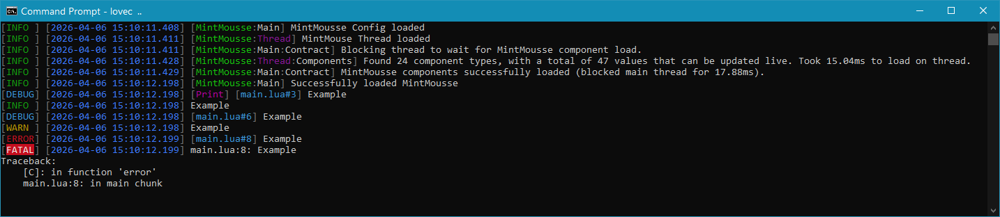

# Logging
MintMousse ships a powerful, thread-safe logging system thats:

- Create named, color-aware loggers with easy hierarchy (`module:submodule:minor`)
- Print to console with automatic ANSI stripping for files
- Route logs anywhere (file, REST, custom sink, etc.)
- Safely handle crashes via [`love.errorhandler`](https://love2d.org/wiki/love.errorhandler) so nothing is missed
- Cleans up traceback to improve readability



!!! note "Piping output to file"
    When you pipe logs to file, e.g. `game.exe &> logs.txt`, MintMousse will detect this and strip all ANSI colors.

    This is the recommended way to store logs to file than adding a sink within your game itself, unless necessary, to prevent performance impact. If you want to implement this, I would suggest to use [`mintmousse.addLogSink`](addLogSink.md) over using [`mintmousse.addGlobalLogSink`](addGlobalLogSink.md), to pipe the logs to your dedicated file writing thread.

## Types
|Type|Description|
|---|---|
|[Logger](logger/index.md)|Logging instance|

## Functions
|Function|Description|
|---|---|
|[`mintmousse.newLogger`](newLogger.md)|Create a new named, colored logger object|
|[`mintmousse.flushLogs`](flushLogs.md)|Flush the log buffer (thread-safe)|
|[`mintmousse.logUncaughtError`](logUncaughtError.md)|Catch errors in [`love.errorhandler`](https://love2d.org/wiki/love.errorhandler)|
|[`mintmousse.addLogSink`](addLogSink.md)|Register a custom destination for all log messages on the current thread|
|[`mintmousse.addGlobalLogSink`](addGlobalLogSink.md)|Register a custom destination for all log messages across the program|
|[`mintmousse.cleanupTraceback`](cleanupTraceback.md)|Removes unhelpful entries from the traceback|

## Enums
|Enum|Description|
|---|---|
|[Color](color.md)|Color definitions for the logging module|

## Quick Start
```lua
-- 1. Create & extend loggers (the most common use)
local moduleLogger = mintmousse.newLogger("module", "cyan")
moduleLogger:info("Module initialized")

local subLogger = moduleLogger:extend("submodule", "bright_blue")
subLogger:warning("You're getting the hang of it now", 5, { ["foo"] = "bar" })

local minorLogger = subLogger:extend("minor")
minorLogger:debug("I print the line I'm on - useful during development!")

print("Quick out") -- overrides print, works like `logger:debug`


-- 2. Catch all error that don't route the expected way
love.errorhandler = function(msg)
  msg = tostring(msg)
  mintmousse.logUncaughtError(msg) -- automatically logs and flushes
  -- ... error screen here
end


-- 3. Advanced: send logs to a server
mintmousse.addLogSink(function(level, logger, time, debugInfo, ...)
  if level == "error" or level == "fatal" then
    -- send to your analytic endpoint
  end
end)
```

The [`(Logger):extend`](logger/extend.md) method automatically builds the `[module:submodule:minor]` prefix to quickly organise your logs.